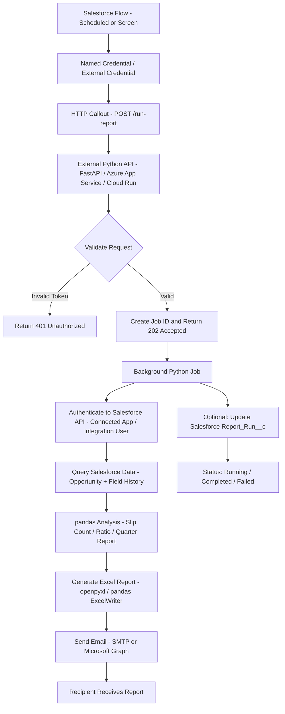
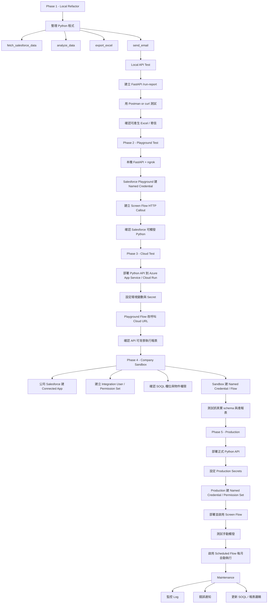

# Salesforce 觸發 Python 自動產生報表架構

## 目標

建立一套由 Salesforce 觸發的自動化報表流程：

```text
Salesforce
    -> 觸發外部 Python API
    -> Python 從 Salesforce 抓資料
    -> pandas 分析
    -> 產生 Excel
    -> 寄送 Email
```

這個方法的重點是：Salesforce 不直接執行 Python，而是透過 HTTP Callout 呼叫外部 Python 服務。正式上線時，Python 應部署在雲端服務或公司伺服器，不建議長期跑在個人電腦上。

## 正式架構流程圖



## 架構角色說明

| 元件 | 角色 |
|---|---|
| Salesforce Flow | 負責排程觸發或手動觸發 |
| Named Credential / External Credential | 保存外部 Python API URL 與驗證設定 |
| Python API | 接收 Salesforce 的觸發請求 |
| Background Python Job | 實際執行報表產生流程 |
| Connected App | 讓 Python 可以安全登入 Salesforce API |
| Integration User | 建議使用的 Salesforce API 專用帳號 |
| pandas | 執行資料清理、groupby、ratio、季度分析 |
| ExcelWriter / openpyxl | 輸出 Excel 報表 |
| SMTP / Microsoft Graph | 寄送 Email |

## 為什麼 Python 不建議跑在個人電腦

測試階段可以用個人電腦執行 Python API，但正式環境不建議。

原因：

- 電腦必須一直開機。
- 網路中斷就無法執行。
- Salesforce 必須能從外部連到你的電腦，通常需要 ngrok、VPN 或 port forwarding。
- 公司資安政策可能不允許。
- 電腦重開機或 Python process 停止後，自動化流程會失效。

正式建議部署位置：

- Azure App Service
- Azure Functions
- Google Cloud Run
- AWS Lambda
- Heroku
- 公司內部 server
- Docker container on VM

## 開發階段流程圖



## Phase 1：整理本機 Python 程式

將目前 `opportunities_analysis.py` 拆成幾個明確函式：

```python
def fetch_salesforce_data(period):
    pass

def analyze_data(dataset):
    pass

def export_excel(report_tables):
    pass

def send_email(file_path, recipient):
    pass

def run_report_job(period, recipient):
    dataset = fetch_salesforce_data(period)
    report_tables = analyze_data(dataset)
    output_file = export_excel(report_tables)
    send_email(output_file, recipient)
```

這樣之後資料來源可以從 Excel 改成 Salesforce API，但 pandas 分析邏輯仍然可以保留。

## Phase 2：建立 Python API

建議使用 FastAPI。

範例結構：

```text
salesforce_report_service/
  main.py
  report_job.py
  requirements.txt
  .env
```

`main.py` 範例：

```python
from fastapi import FastAPI, BackgroundTasks, Header, HTTPException
from pydantic import BaseModel
from uuid import uuid4
from report_job import run_report_job

app = FastAPI()

REPORT_TRIGGER_TOKEN = "change-this-secret"

class ReportRequest(BaseModel):
    period: str | None = "last_month"
    recipient: str
    requested_by: str | None = None

@app.post("/run-report")
def run_report(
    request: ReportRequest,
    background_tasks: BackgroundTasks,
    x_report_token: str = Header(default="")
):
    if x_report_token != REPORT_TRIGGER_TOKEN:
        raise HTTPException(status_code=401, detail="Unauthorized")

    job_id = str(uuid4())

    background_tasks.add_task(
        run_report_job,
        job_id,
        request.period,
        request.recipient,
        request.requested_by
    )

    return {
        "status": "accepted",
        "jobId": job_id,
        "message": "Report job started"
    }
```

API 收到 Salesforce 請求後應立即回覆 `202 Accepted` 類型的結果，避免 Salesforce 等待整份報表完成。

## Phase 3：Playground 測試

在沒有公司 Salesforce 權限時，可先用 Playground 驗證流程。

測試方式：

```text
Salesforce Playground Flow
    -> ngrok HTTPS URL
    -> 本機 FastAPI
```

此階段目標只是確認：

- Salesforce Flow 可以呼叫外部 API。
- Named Credential 設定可行。
- Python API 可以接收 request。
- API token 驗證可正常運作。

注意：ngrok + 本機 API 只適合測試，不適合正式環境。

## Phase 4：部署到雲端測試

將 Python API 部署到雲端服務，例如：

```text
Azure App Service
Google Cloud Run
AWS Lambda
Heroku
```

部署後，Salesforce Flow 改呼叫雲端 URL：

```text
https://your-report-service.example.com/run-report
```

環境變數應放在雲端平台設定中，不要寫死在程式碼：

```text
REPORT_TRIGGER_TOKEN=...
SF_LOGIN_URL=...
SF_CLIENT_ID=...
SF_CLIENT_SECRET=...
SMTP_HOST=...
SMTP_USER=...
SMTP_PASSWORD=...
```

## Phase 5：公司 Sandbox 測試

進入公司 Salesforce Sandbox 後，需要請管理員協助：

- 建立 Connected App。
- 建立 Integration User。
- 指派必要 Permission Set。
- 確認 SOQL 需要的物件與欄位。
- 確認 Opportunity Field History 是否可查。
- 建立 Named Credential / External Credential。
- 建立或部署 Flow。

要特別確認欄位 API Name，例如：

```text
Opportunity.Name
Opportunity.Owner.Name
Opportunity.CloseDate
OpportunityFieldHistory.OldValue
OpportunityFieldHistory.NewValue
OpportunityFieldHistory.CreatedDate
Custom_Field__c
```

Playground 的欄位名稱與公司正式環境不一定相同。

## Phase 6：Production 上線

正式環境建議流程：

```text
1. 部署正式 Python API
2. 設定 Production 環境變數
3. Production 建立 Named Credential / External Credential
4. Production 建立 Permission Set
5. 指派 Permission Set 給 Flow 執行者
6. 部署 Screen Flow
7. 手動測試成功
8. 啟用 Scheduled Flow
```

建議先啟用手動 Screen Flow，確認可成功產生報表與寄信後，再啟用每月排程。

## Salesforce 端設定摘要

需要的 Salesforce 元件：

```text
Named Credential
External Credential
Permission Set
Flow HTTP Callout Action
Screen Flow
Scheduled Flow
Connected App
Integration User
```

## 可選：建立 Report_Run__c 追蹤報表執行

如果想讓 Salesforce 中也能看到每次報表是否成功，可以建立 Custom Object：

```text
Report_Run__c
```

建議欄位：

```text
Job_Id__c
Status__c
Period__c
Recipient__c
Requested_By__c
Requested_At__c
Completed_At__c
Error_Message__c
Report_File_Link__c
```

Python job 流程：

```text
開始時：Status = Running
成功時：Status = Completed
失敗時：Status = Failed，寫入 Error_Message
```

