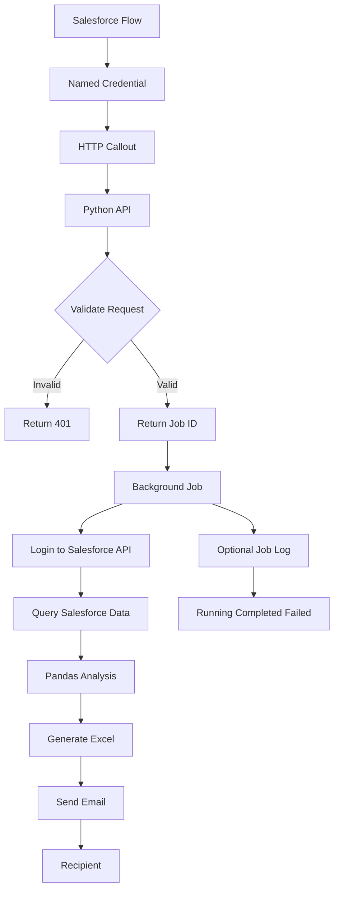
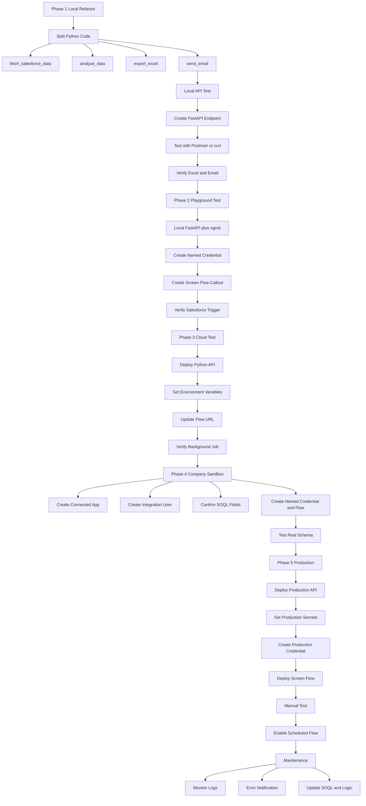

# Salesforce-Triggered Python Report Automation Architecture

## Goal

Build an automated reporting process triggered from Salesforce:

```text
Salesforce
    -> triggers an external Python API
    -> Python queries data from Salesforce
    -> pandas performs the analysis
    -> Python generates an Excel report
    -> Python sends the report by email
```

The key idea is that Salesforce does not run Python directly. Salesforce sends an HTTP Callout to an external Python service. For production use, the Python service should run in a cloud service or company server, not on a personal computer.

## Production Architecture



## Component Responsibilities

| Component | Responsibility |
|---|---|
| Salesforce Flow | Triggers the process on a schedule or manually |
| Named Credential / External Credential | Stores the external Python API URL and authentication settings |
| Python API | Receives the trigger request from Salesforce |
| Background Python Job | Runs the actual report generation process |
| Connected App | Allows Python to authenticate securely to the Salesforce API |
| Integration User | Recommended dedicated Salesforce API user |
| pandas | Cleans data and performs groupby, ratio, and quarterly analysis |
| ExcelWriter / openpyxl | Exports the Excel report |
| SMTP / Microsoft Graph | Sends the report by email |

## Why Python Should Not Run on a Personal Computer

Running the Python API on a personal computer is acceptable for testing, but it is not recommended for production.

Problems with running it locally:

- The computer must always stay powered on.
- Network disconnection breaks the process.
- Salesforce must be able to reach the computer from the internet.
- This usually requires ngrok, VPN, or port forwarding.
- Company security policy may not allow it.
- Restarting the computer or stopping the Python process breaks the automation.

Recommended production hosting options:

- Azure App Service
- Azure Functions
- Google Cloud Run
- AWS Lambda
- Heroku
- Company internal server
- Docker container on a VM

## Development Phases



## Phase 1: Refactor the Local Python Script

Refactor the current `opportunities_analysis.py` into clear functions:

```python
def fetch_salesforce_data(period):
    pass

def analyze_data(dataset):
    pass

def export_excel(report_tables):
    pass

def send_email(file_path, recipient):
    pass

def run_report_job(period, recipient):
    dataset = fetch_salesforce_data(period)
    report_tables = analyze_data(dataset)
    output_file = export_excel(report_tables)
    send_email(output_file, recipient)
```

This keeps the pandas analysis logic reusable while allowing the data source to change from Excel to the Salesforce API.

## Phase 2: Create the Python API

FastAPI is a good choice for the external API service.

Suggested project structure:

```text
salesforce_report_service/
  main.py
  report_job.py
  requirements.txt
  .env
```

Example `main.py`:

```python
from fastapi import FastAPI, BackgroundTasks, Header, HTTPException
from pydantic import BaseModel
from uuid import uuid4
from report_job import run_report_job

app = FastAPI()

REPORT_TRIGGER_TOKEN = "change-this-secret"

class ReportRequest(BaseModel):
    period: str | None = "last_month"
    recipient: str
    requested_by: str | None = None

@app.post("/run-report")
def run_report(
    request: ReportRequest,
    background_tasks: BackgroundTasks,
    x_report_token: str = Header(default="")
):
    if x_report_token != REPORT_TRIGGER_TOKEN:
        raise HTTPException(status_code=401, detail="Unauthorized")

    job_id = str(uuid4())

    background_tasks.add_task(
        run_report_job,
        job_id,
        request.period,
        request.recipient,
        request.requested_by
    )

    return {
        "status": "accepted",
        "jobId": job_id,
        "message": "Report job started"
    }
```

The API should return quickly after receiving a Salesforce request. The actual report generation should run in the background so Salesforce does not wait for the entire report to finish.

## Phase 3: Test with Salesforce Playground

When company Salesforce permissions are not available, use a Salesforce Playground to validate the architecture.

```text
Salesforce Playground Flow
    -> ngrok HTTPS URL
    -> local FastAPI
```

Goals for this phase:

- Confirm Salesforce Flow can call an external API.
- Confirm Named Credential configuration works.
- Confirm the Python API receives requests.
- Confirm API token validation works.

Note: ngrok plus a local API is only for testing. It is not suitable for production.

## Phase 4: Deploy to a Cloud Test Environment

Deploy the Python API to a cloud platform such as:

```text
Azure App Service
Google Cloud Run
AWS Lambda
Heroku
```

After deployment, update the Salesforce Flow to call the cloud URL:

```text
https://your-report-service.example.com/run-report
```

Environment variables should be configured in the cloud platform, not hardcoded in source code:

```text
REPORT_TRIGGER_TOKEN=...
SF_LOGIN_URL=...
SF_CLIENT_ID=...
SF_CLIENT_SECRET=...
SMTP_HOST=...
SMTP_USER=...
SMTP_PASSWORD=...
```

## Phase 5: Test in the Company Sandbox

After moving to the company Salesforce Sandbox, ask the Salesforce administrator to help with:

- Creating the Connected App.
- Creating the Integration User.
- Assigning the required Permission Set.
- Confirming required SOQL objects and fields.
- Confirming whether Opportunity Field History is available.
- Creating the Named Credential / External Credential.
- Creating or deploying the Flow.

Confirm the actual Salesforce API field names, for example:

```text
Opportunity.Name
Opportunity.Owner.Name
Opportunity.CloseDate
OpportunityFieldHistory.OldValue
OpportunityFieldHistory.NewValue
OpportunityFieldHistory.CreatedDate
Custom_Field__c
```

Field names in a Playground may not match the company Salesforce org.

## Phase 6: Production Deployment

Recommended production rollout:

```text
1. Deploy the production Python API
2. Set production environment variables
3. Create Production Named Credential / External Credential
4. Create Production Permission Set
5. Assign the Permission Set to the Flow execution user
6. Deploy the Screen Flow
7. Test manual execution successfully
8. Enable the Scheduled Flow
```

It is recommended to enable the manual Screen Flow first. After confirming the report and email work correctly, enable the monthly Scheduled Flow.

## Salesforce Configuration Summary

Required Salesforce components:

```text
Named Credential
External Credential
Permission Set
Flow HTTP Callout Action
Screen Flow
Scheduled Flow
Connected App
Integration User
```

Separate the two authentication directions clearly:

```text
Salesforce -> Python API
Uses Named Credential / External Credential

Python API -> Salesforce
Uses Connected App / OAuth / Integration User
```

## Security Recommendations

At minimum:

- The Python API must use HTTPS.
- Salesforce callouts should use Named Credential.
- The API endpoint should validate a header token or OAuth token.
- Salesforce API access should use an Integration User.
- All secrets should be stored in environment variables.
- `.env` must not be committed to git.
- Production and Sandbox should use different tokens.

More formal options:

- IP allowlist
- mTLS
- Azure API Management
- OAuth 2.0 Client Credentials
- Job log object

## Optional: Create `Report_Run__c` for Job Tracking

To track report execution in Salesforce, create a custom object:

```text
Report_Run__c
```

Suggested fields:

```text
Job_Id__c
Status__c
Period__c
Recipient__c
Requested_By__c
Requested_At__c
Completed_At__c
Error_Message__c
Report_File_Link__c
```

Python job status flow:

```text
At start: Status = Running
On success: Status = Completed
On failure: Status = Failed, write Error_Message
```

## Final Recommendation

Short-term testing:

```text
Playground Flow -> ngrok -> local FastAPI
```

Production architecture:

```text
Salesforce Flow -> Named Credential -> Cloud Python API -> Salesforce API -> Excel -> Email
```

For production, do not run Python on a personal computer. The personal computer should only be used for development, testing, and deployment. The actual report service should run in the cloud or on a company server.

